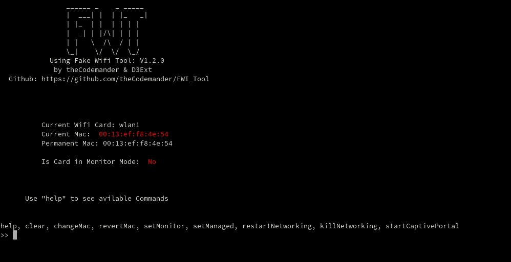

<html>
<body>
  <h1>FWT (Fake Wifi Tool)</h1> 

  Use setup.sh to install the tool.
  
  To use FWT type in your terminal:
  
  <code>sudo fwt -i [network card]</code>
  
  You can develop your own phishing Page and place it in the templates folder. 
  <code>/opt/fwt/main/templates/template_folder</code> 
  This tool was developed only for Arch Linux.

  
  

Usage of FWT for attacking targets without prior mutual consent is illegal. It's the end user's responsibility to obey all applicable local, state and federal laws. Developers assume no liability and are not responsible for any misuse or damage caused by this program.

</body>

</html>
